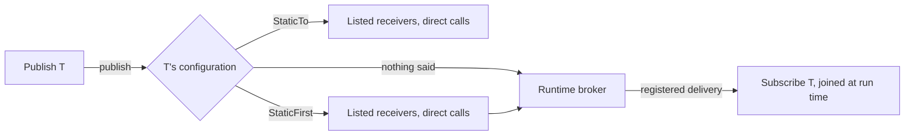

# Sub0Pub

> Sub0Pub began as a spare-time project, written by hand in 2018 to explore type-safe messaging in C++. This v2
> release develops that original idea into a more complete library. It is CI-tested, but has not yet been
> field-tested; the `v1.0` tag preserves the previous baseline.

**Typed publish-subscribe for C++23 that compiles to direct calls when the receivers are known.**

Sub0Pub is a header-only library for synchronous, type-safe message delivery. Write publishers and subscribers once;
each message type then says whether it is delivered through a bounded runtime broker, where subscribers come and go
independently, or by direct calls to a known set of receivers. The core does not allocate broker storage from the
heap; optional policies and application callbacks have their own costs.

> **Status:** v2.0.0-alpha is CI-tested, but has not yet been field-tested. The `v1.0` tag preserves the previous
> baseline.

## One API; the message type decides the delivery

```cpp
struct TemperatureReading { int celsius; };

class Sensor : public sub0::Publish<TemperatureReading> {
public:
    void sample(int celsius) noexcept { sub0::publish(*this, TemperatureReading{celsius}); }
};

class Display : public sub0::Subscribe<TemperatureReading> {
public:
    void receive(const TemperatureReading& reading) noexcept { /* show it */ }
};
```

As written, a `Display` subscribes when it is constructed and leaves when it is destroyed: the runtime broker
delivers through a bounded, per-type table. When the receivers of a type are known, name them beside the type and
the same code compiles to direct calls, with no table, registration or virtual call behind it:

```cpp
class Display;
extern Display display;

struct TemperatureReading {
    int celsius;
    using sub0_config = sub0::config<sub0::StaticTo<&display>>;
};
```



| | Your case | Say on the type | Main constraint |
|---|---|---|---|
| 1 | Receivers register and leave independently. Start here. | nothing | Fixed capacity; registration can fail when the table is full. |
| 2 | The receivers are a closed set of objects with static storage. | `sub0::StaticTo<&a, &b>` | The list is the whole truth: nothing joins or leaves at run time. |
| 3 | A fixed core, plus receivers that come and go. | `sub0::StaticFirst<&a>` | The broker's cost stays on every publication. |

A publication that reaches no receiver is treated as a mistake: a debug build reports it, and a `StaticTo` list
nobody can receive from does not compile. A type for which that is expected says `sub0::AllowNoReceivers`.

See [basic pub/sub](examples/basic_pubsub/main.cpp) for the subscriber lifecycle,
[promote to static](examples/promote_to_static/main.cpp) for one application built both ways from one source, and
[dynamic diagnostics](examples/dynamic_diagnostics.cpp) for a fixed receiver with runtime probes beside it.

### When the type cannot decide

Receivers that are local objects, several independent wirings of one message type, a receiver that stops a
publication, and a transport bound beside local receivers are composed explicitly, with plain receiver classes:

```cpp
auto wiring = sub0::wire(display, logger);
wiring.publish(TemperatureReading{22});
```

`wire(...)`, `StaticWiring`, `Sink<T>`, `Forward` and `BrokerPort<T>` each exist for a specific case; the
[usage guide](docs/USAGE.md#explicit-wiring-when-the-type-cannot-decide) lists which.

## Get started

Requirements: C++23 and CMake 3.21+. The CMake target propagates the language requirement; direct header users must
select C++23 themselves.

```cmake
find_package(Sub0Pub REQUIRED)
target_link_libraries(MyApp PRIVATE Sub0Pub::Sub0Pub)
```

Alternatively, add Sub0Pub as a subdirectory:

```cmake
add_subdirectory(Sub0Pub)
target_link_libraries(MyApp PRIVATE Sub0Pub::Sub0Pub)
```

Build and run the tests from a clone:

```sh
cmake --preset default
cmake --build --preset default
ctest --preset default
```

`#include <sub0pub/sub0pub.hpp>` includes the full library. For smaller includes, see the
[header map](docs/USAGE.md#headers).

## Feature guides

The README is an overview; detailed behavior, constraints, and complete examples live in focused guides:

| Guide | Covers |
|---|---|
| [Usage and wiring](docs/USAGE.md) | Which delivery to choose by case, moving a type to direct calls, explicit wiring, callback behavior, subscriber lifetime, and examples |
| [Per-type configuration](docs/CONFIGURATION.md) | Where a type's configuration goes, topology, dispatch, context, capacity, filtering, cancellation, locking, scoped domains, and project defaults |
| [IPC and transports](docs/IPC.md) | Routes, forwarding, stream serialization, layout checks, and wire-format responsibilities |
| [Runnable examples](examples/README.md) | Standalone programs for the current API, organized by use case |
| [Design and contracts](docs/DESIGN.md) | Design rationale, measured constraints, and known limitations |
| [Comparisons](docs/COMPARISONS.md) | Architectural trade-offs versus related libraries; not a speed ranking |
| [v1 migration](MIGRATION.md) | Behavior and API changes from the v1 baseline |

## How it compares

Sub0Pub focuses on synchronous typed delivery, fixed-capacity broker storage, and direct calls when the receiver set
is known. It does not provide an event queue, scheduler, or GUI event loop. Whether that is a good fit depends on the
application; the [comparison notes](docs/COMPARISONS.md) describe the trade-offs without claiming cross-library
performance superiority.

## Performance and validation

Performance claims are measured against equivalent hand-written work. See the current
[performance baseline](docs/PERFORMANCE_BASELINE.md), [measurement evidence](docs/EVIDENCE.md), and
[compile-time measurements](docs/COMPILE_TIME.md). The benchmark suite can be built with the tests:

```sh
cmake --build --preset default --target Sub0Pub_Bench
```

CI covers GCC, Clang, AppleClang, and MSVC on Linux, macOS, and Windows, with sanitizer configurations. This testing
does not replace integration testing on a project's target platform.

## License

[MIT License](LICENSE.md) -- Copyright (c) 2018 Craig Hutchinson
