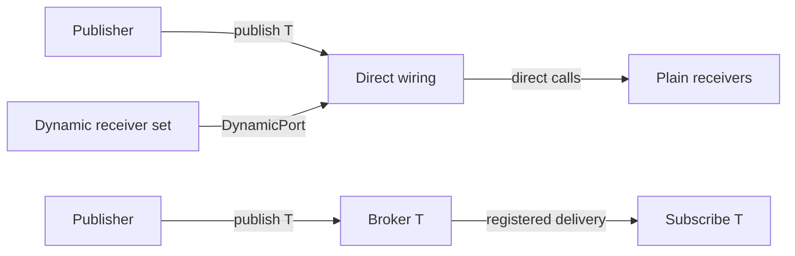

# Sub0Pub

> Sub0Pub began as a spare-time project, written by hand in 2018 to explore type-safe messaging in C++. This v2
> release develops that original idea into a more complete library. It is CI-tested, but has not yet been
> field-tested; the `v1.0` tag preserves the previous baseline.

**Typed publish-subscribe and direct-call wiring for C++23.**

Sub0Pub is a header-only library for synchronous, type-safe message delivery. Choose a bounded runtime broker when
subscribers come and go independently, or compose a known receiver set for direct calls. The core does not allocate
broker storage from the heap; optional policies and application callbacks have their own costs.

> **Status:** v2.0.0-alpha is CI-tested, but has not yet been field-tested. The `v1.0` tag preserves the previous
> baseline.

## Choose a delivery model



| | Direct wiring | Runtime broker |
|---|---|---|
| Use when | The application knows the receiver set at composition time. | Receivers need to register and leave independently. |
| API | `StaticWiring<&receiver, ...>` or `wire(receiver, ...)` | `Publish<T>` and `Subscribe<T>` |
| Receiver | Plain class with `receive(const T&)` | `Subscribe<T>` implementation with virtual `receive()` |
| Delivery | Direct calls; `wire(...)` binds object addresses at runtime but does not use the broker. | Bounded per-type table; subscribers register and unregister with their lifetime. |
| Main constraint | Wiring borrows its receivers; they must outlive it. No automatic lifetime tracking. | Fixed capacity; subscriber registration can fail when the table is full. |

### Direct wiring

Use this path for a fixed topology and plain receiver classes. `StaticWiring` puts receiver addresses in the wiring
type; `wire(...)` binds ordinary objects at runtime. Both make direct calls without a broker table or virtual
`receive()` dispatch.

```cpp
auto wiring = sub0::wire(display, logger);
wiring.publish(TemperatureReading{22});
```

See [runtime-bound wiring](examples/local_wiring.cpp) and [fixed-address wiring](examples/static_addresses.cpp).

### Runtime publish/subscribe

Use the broker when objects should discover messages by type and join or leave through their lifetimes. Publishers
do not keep receiver lists.

```cpp
class Sensor : public sub0::Publish<float> {
public:
    void sample(float value) { sub0::publish(this, value); }
};

class Display : public sub0::Subscribe<float> {
    void receive(const float& value) noexcept override { /* display value */ }
};
```

See [basic pub/sub](examples/basic_pubsub/main.cpp) for the complete lifecycle example and
[multi-type subscriptions](examples/multi_type/main.cpp) for several message types.

### Combining the paths

`DynamicPort<T, N>` adds a bounded set of runtime-bound receivers to direct wiring. `BrokerPort<T>` connects direct
wiring to a runtime broker when broker policies are needed. These are explicit bridges, not automatic conversions;
their ownership and delivery constraints are covered in the [usage guide](docs/USAGE.md).

## Get started

Requirements: C++23 and CMake 3.21+. The CMake target propagates the language requirement; direct header users must
select C++23 themselves.

```cmake
find_package(Sub0Pub REQUIRED)
target_link_libraries(MyApp PRIVATE Sub0Pub::Sub0Pub)
```

Alternatively, add Sub0Pub as a subdirectory:

```cmake
add_subdirectory(Sub0Pub)
target_link_libraries(MyApp PRIVATE Sub0Pub::Sub0Pub)
```

Build and run the tests from a clone:

```sh
cmake --preset default
cmake --build --preset default
ctest --preset default
```

`#include <sub0pub/sub0pub.hpp>` includes the full library. For smaller includes, see the
[header map](docs/USAGE.md#headers).

## Feature guides

The README is an overview; detailed behavior, constraints, and complete examples live in focused guides:

| Guide | Covers |
|---|---|
| [Usage and wiring](docs/USAGE.md) | Choosing direct wiring or the broker, hybrid ports, callback behavior, subscriber lifetime, and examples |
| [Per-type configuration](docs/CONFIGURATION.md) | Dispatch, context, capacity, filtering, cancellation, locking, scoped domains, and project defaults |
| [IPC and transports](docs/IPC.md) | Routes, forwarding, stream serialization, layout checks, and wire-format responsibilities |
| [Runnable examples](examples/README.md) | Standalone programs for the current API, organized by use case |
| [Design and contracts](docs/DESIGN.md) | Design rationale, measured constraints, and known limitations |
| [Comparisons](docs/COMPARISONS.md) | Architectural trade-offs versus related libraries; not a speed ranking |
| [v1 migration](MIGRATION.md) | Behavior and API changes from the v1 baseline |

## How it compares

Sub0Pub focuses on synchronous typed delivery, fixed-capacity broker storage, and direct wiring when the receiver set
is known. It does not provide an event queue, scheduler, or GUI event loop. Whether that is a good fit depends on the
application; the [comparison notes](docs/COMPARISONS.md) describe the trade-offs without claiming cross-library
performance superiority.

## Performance and validation

Performance claims are measured against equivalent hand-written work. See the current
[performance baseline](docs/PERFORMANCE_BASELINE.md), [measurement evidence](docs/EVIDENCE.md), and
[compile-time measurements](docs/COMPILE_TIME.md). The benchmark suite can be built with the tests:

```sh
cmake --build --preset default --target Sub0Pub_Bench
```

CI covers GCC, Clang, AppleClang, and MSVC on Linux, macOS, and Windows, with sanitizer configurations. This testing
does not replace integration testing on a project's target platform.

## License

[MIT License](LICENSE.md) -- Copyright (c) 2018 Craig Hutchinson
