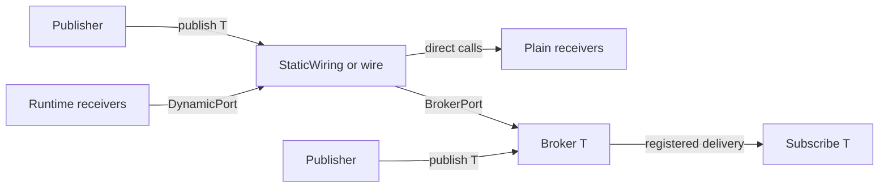

# Usage and wiring

Sub0Pub has two local delivery models. Choose based on receiver lifetime and topology, not on whether addresses are
bound at compile time.



| | Direct wiring | Runtime broker |
|---|---|---|
| Receiver type | Plain class with matching `receive(const T&)` methods | Class derived from `Subscribe<T>` |
| Binding | `StaticWiring<&a, &b>` at compile time, or `wire(a, b)` at runtime | Construction registers the subscriber; destruction disconnects it |
| Storage and dispatch | Receiver references in wiring; direct calls | Fixed-capacity table per message type; virtual calls |
| Lifetime | Wiring borrows receivers; keep them alive as long as the wiring can publish. | Subscriber lifetime controls registration; domains, when used, must outlive bound objects. |
| Best fit | Known topology, small hot paths, or application-composed components | Optional subscribers, scoped sessions, filters, or broker locking |

## Direct wiring

Use direct wiring when the application knows which objects should receive a message. Receiver classes do not inherit
from Sub0Pub:

```cpp
struct TemperatureReading { int celsius; };

struct Display {
    void receive(const TemperatureReading& reading) noexcept;
};

Display display;
auto wiring = sub0::wire(display);
wiring.publish(TemperatureReading{22});
```

`wire(...)` binds object addresses at runtime, but delivery remains direct: there is no runtime broker, subscription
table, or virtual `receive()` call. The wiring borrows the objects, so they must outlive it.

Use `StaticWiring<&display, ...>` when receiver addresses have static storage duration and can be named in the type.
It makes the topology explicit at compile time and does not track object lifetime. See the
[local wiring](../examples/local_wiring.cpp) and [static addresses](../examples/static_addresses.cpp) examples.

For type-erased publisher boundaries, `Sink<T>` wraps a wiring. `Publisher<Derived, Output>` is a CRTP convenience
when the publisher implementation should not name its concrete wiring type. See [sink output](../examples/sink_output.cpp).

## Runtime broker

Use `Publish<T>` and `Subscribe<T>` when receivers register independently of the publisher:

```cpp
class Sensor : public sub0::Publish<TemperatureReading> {
public:
    void sample(int celsius) {
        sub0::publish(this, TemperatureReading{celsius});
    }
};

class Display : public sub0::Subscribe<TemperatureReading> {
    void receive(const TemperatureReading& reading) noexcept override;
};
```

An unlocked subscriber registers during construction and disconnects during destruction. Its type's broker has a
fixed capacity (8 by default); check `isSubscribed()` when registration success matters. If a slot later becomes
available, `trySubscribe()` can retry. See [basic pub/sub](../examples/basic_pubsub/main.cpp) and
[dynamic lifetime](../examples/dynamic_lifetime.cpp).

### Delivery behavior

- **Filtering:** `filter()` can skip delivery to one subscriber; other subscribers are still considered. It costs one
  filter call per subscriber and is enabled per type or with `SUB0PUB_FILTER`. See
  [filtering](../examples/filtering/main.cpp).
- **Cancellation:** `cancel()` stops delivery to later subscribers for the current publication. It does not
  disconnect a subscriber or affect later publications; order matters. A publish context is required. See
  [cancellation](../examples/cancellation/main.cpp).
- **Changes during delivery:** nested publication is supported. Adding/removing a subscriber of the same type during
  its active dispatch, including self-destruction, requires `Snapshot`. Snapshot dispatch copies the table for that
  publication. See [dynamic lifetime](../examples/dynamic_lifetime.cpp).
- **Concurrency:** unlocked use of one message type must not overlap across threads. `LockWith<L>` enables concurrent
  broker use, but application callback state still needs synchronization because callbacks may overlap. Locked
  subscribers must call `trySubscribe()` at the end of the most-derived constructor and `disconnect()` at the start
  of its destructor. See [thread-safe lifetime](../examples/thread_safe_lifetime.cpp).

See [configuration](CONFIGURATION.md) for the available policies and their setup.

## Combining direct wiring and the broker

These adapters make the boundary explicit:

- `DynamicPort<T, N>` provides fixed runtime slots for plain receivers in a direct wiring. It borrows receiver
  pointers; removal must happen before receiver destruction. It is not safe for overlapping add/remove and publish.
  See [dynamic diagnostics](../examples/dynamic_diagnostics.cpp).
- `BrokerPort<T>` binds a broker/domain as a receiver in direct wiring. Use it when the dynamic side needs broker
  behavior such as snapshot dispatch or scoped storage. See [scoped diagnostics](../examples/scoped_diagnostics.cpp).
- `Forward<Transport>` and `StaticForward<&transport>` bind transport endpoints to direct wiring. For runtime broker
  routes, use `Route<T, Transport>`. See [link forwarding](../examples/link_forwarding.cpp) and
  [route reports](../examples/route_reports.cpp).

No adapter schedules work on another thread. See [IPC and transports](IPC.md) for forwarding and serialization
responsibilities.

## Headers

`sub0pub/sub0pub.hpp` includes the full library. Include a narrower header when only one area is needed:

| Header | Provides |
|---|---|
| `sub0pub/broker.hpp` | Runtime broker, `Subscribe`, `Publish`, `SubscribeAll`, `Domain`, `Route`, configuration |
| `sub0pub/wiring.hpp` | Direct wiring, `wire`, `StaticWiring`, `Sink`, `Publisher`, `Forward`, `DynamicPort` |
| `sub0pub/ipc.hpp` | `StreamSerializer`, `StreamDeserializer`, binary serialization |
| `sub0pub/config.hpp` | Per-type configuration |

Some bridge headers need both sides they connect: `sub0pub/wiring/broker_port.hpp` and
`sub0pub/ipc/forward.hpp`.
