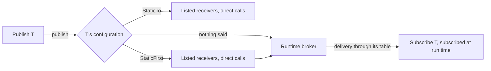

# Usage and wiring

Sub0Pub is used through one vocabulary. A receiver derives from `Subscribe<T>`, a publisher derives from
`Publish<T>` and calls `sub0::publish(*this, message)`, and **the message type decides how the two are connected**.
Code written this way does not change when that decision does.



## Which one, by case

Start at the top and move down only when the case beside a step is yours.

| | Your case | What you write | Example |
|---|---|---|---|
| 1 | Receivers subscribe and unsubscribe with their lifetimes, or you are still shaping the application. **Start here.** | `Subscribe<T>`, `Publish<T>`; nothing on the type | [basic_pubsub](../examples/basic_pubsub/main.cpp) |
| 2 | A type's receivers are now a closed set of objects with static storage, and its publications should cost what direct calls cost | add `sub0::StaticTo<&a, &b>` beside the type | [promote_to_static](../examples/promote_to_static/main.cpp), [static_addresses](../examples/static_addresses.cpp) |
| 3 | Some receivers of the type are fixed, others still subscribe and unsubscribe at run time | add `sub0::StaticFirst<&a>` beside the type | [dynamic_diagnostics](../examples/dynamic_diagnostics.cpp) |
| | The type cannot name its receivers: they are locals, or one type has several independent wirings, or a receiver must stop a publication, or a transport is one of the receivers | [explicit wiring](#explicit-wiring-when-the-type-cannot-decide) | [local_wiring](../examples/local_wiring.cpp) |

## 1. The runtime broker

```cpp
struct TemperatureReading { int celsius; };

class Sensor : public sub0::Publish<TemperatureReading> {
public:
    void sample(int celsius) noexcept { sub0::publish(*this, TemperatureReading{celsius}); }
};

class Display : public sub0::Subscribe<TemperatureReading> {
public:
    void receive(const TemperatureReading& reading) noexcept;
};
```

An unlocked subscriber subscribes during construction and unsubscribes during destruction. Its type's broker has a
fixed capacity (8 by default); check `isSubscribed()` when it matters that the subscription succeeded. If a slot later becomes
available, `trySubscribe()` can retry. See [basic pub/sub](../examples/basic_pubsub/main.cpp) and
[dynamic lifetime](../examples/dynamic_lifetime.cpp).

`receive()` needs no `override`. A signature that does not match is a compile error either way (the base's
`receive` is pure), and without the keyword the same class serves the type at step 2, where the base has nothing to
override.

### Delivery behavior

- **Unheard publications:** publishing a type that nobody is subscribed to is reported in debug builds
  (`SUB0PUB_NO_RECEIVERS`; assert, then abort). It usually means a publisher started before its subscribers. Where
  an absent receiver is expected, say so on the type with `sub0::AllowNoReceivers`; a call site that wants to decide
  for itself asks `sub0::receiverCount<T>(publisher)`. `sub0::ReportNoReceivers` checks a type in release builds too.
- **Filtering:** `filter()` can skip delivery to one subscriber; other subscribers are still considered. It costs one
  filter call per subscriber and is enabled per type with `sub0::Filter`. See
  [filtering](../examples/filtering/main.cpp).
- **Cancellation:** `cancel()` stops delivery to later subscribers for the current publication. It does not
  unsubscribe a subscriber or affect later publications; order matters. A publish context is required. See
  [cancellation](../examples/cancellation/main.cpp).
- **Changes during delivery:** nested publication is supported. Adding/removing a subscriber of the same type during
  its active dispatch, including self-destruction, requires `Snapshot`. Snapshot dispatch copies the table for that
  publication. See [dynamic lifetime](../examples/dynamic_lifetime.cpp).
- **Concurrency:** unlocked use of one message type must not overlap across threads. `LockWith<L>` enables concurrent
  broker use, but application callback state still needs synchronization because callbacks may overlap. Locked
  subscribers must call `trySubscribe()` at the end of the most-derived constructor and `unsubscribe()` at the start
  of its destructor. See [thread-safe lifetime](../examples/thread_safe_lifetime.cpp).

See [configuration](CONFIGURATION.md) for the available policies and their setup.

## 2. A type with fixed receivers: `StaticTo`

Declare the receivers, then name them beside the type. Nothing else in the code above changes:

```cpp
class Display;
extern Display display;                 // static storage, declared before the type that names it

struct TemperatureReading {
    int celsius;
    using sub0_config = sub0::config<sub0::StaticTo<&display>>;
};
```

`sub0::publish(*this, TemperatureReading{22})` now compiles to a call of `display.receive()`. `Subscribe` is an
empty base and `Publish` an empty handle: no subscription table, no run-time subscription, no virtual call. What changes for
the type, and how each change is caught:

| Rule | If you get it wrong |
|---|---|
| The list is the whole set of receivers, called in the order of the list. | A subscriber the list does not name is never called; a debug build reports its construction (`SUB0PUB_UNLISTED_RECEIVER`). |
| A unit that publishes the type includes the definitions of the listed receivers. | Compile error. |
| A listed receiver that subscribes to the type has a `receive(const T&)`. | Compile error. |
| Somebody in the list can receive the type, unless the type is `AllowNoReceivers`. | Compile error. |
| `filter()` needs the type's `sub0::Filter`, as on the broker, and the broker's signature. | Compile error. |
| No `isSubscribed()`, `trySubscribe()`, `unsubscribe()`, `cancel()`, `Domain`, `Route` or publish report: they need a table. | Compile error. |
| Every unit sees the same configuration, which a member alias guarantees. | A debug build reports a unit that disagrees. |

The receivers are borrowed: publish only while they are alive. To take a type back to the broker, remove the line.

## 3. Fixed receivers, and others at run time: `StaticFirst`

```cpp
struct TemperatureReading {
    int celsius;
    using sub0_config = sub0::config<sub0::Capacity<4>, sub0::StaticFirst<&controller>>;
};
```

The listed receivers are called directly, first and in order; the runtime broker then delivers to whoever is
subscribed. Everything the broker offers remains available to the runtime side, with the type's own configuration.
A listed receiver has no entry in the table, does not use its capacity, and reports `isSubscribed()` as true. The
broker's cost stays on every publication, so list every receiver with `StaticTo` once the set is closed.

## Finding wiring mistakes: the audit build

Publish/subscribe fails quietly: a message nobody received and a receiver that was never called both look like
nothing happening. Build the program with `SUB0PUB_AUDIT` defined true for every translation unit and it records
each publication and delivery, through the broker and through `StaticTo` / `StaticFirst` lists, then writes a report
when it exits:

```text
sub0pub audit: 2 findings
  Alarm: 1 of 1 publication reached no receiver; 1 by Thermometer
  Alarm: AlarmLog at 0x7ffd3c1a2b40 never received it: it subscribed after the last publication
  Reading: 2 publications; runtime table peaked at 1 of 8
    published by Thermometer: 2
    1. Display at 0x7ffd3c1a2b50: 2 deliveries
    its receivers never changed: a candidate for sub0::StaticTo, in this order, if they have static storage
```

| Finding | What it usually means |
|---|---|
| publications reached no receiver | a publisher that starts before its subscribers; say `AllowNoReceivers` on the type if that is expected |
| a subscriber never received it | it subscribed too late, unsubscribed too early, or the message is never sent on this path |
| never published | a subscriber waiting for a message that nothing in this run publishes |
| a subscription refused | the type's `Capacity` is smaller than the number of subscribers that want it |
| not in its `StaticTo` list | a subscriber of a statically wired type that the type does not name: it is never called |

Below the findings, each message type lists its publishers and its receivers in the order they subscribed. The last
line of a brokered type is the migration hint: receivers that were all there before the first publication and
stayed are what [`StaticTo`](#2-a-type-with-fixed-receivers-staticto) needs, in that order.

- A test asks for the count with `sub0::auditFindings()`, or writes the report on request with `sub0::auditReport()`.
  Both are the constant 0 in an ordinary build, so the calls can stay.
- `SUB0PUB_AUDIT_PRINT(line)` sends each line somewhere other than stderr; `SUB0PUB_AUDIT_EXIT(findings)` runs after
  the report at exit, for example to fail a CI run that has findings.
- It is a diagnostic build. Every publication, delivery and subscription takes a process-wide lock, the checks that
  stop a debug build at the first mistake default to off so the run completes, and it reports this run only. It
  does not record explicit wirings; the full list of what it cannot see is K33 in [the design](DESIGN.md#known-limitations).

See [audit findings](../examples/audit_findings.cpp) for five mistakes and what the audit says about each.

## Explicit wiring: when the type cannot decide

`StaticTo` needs receivers with static storage and allows one list per type. For anything else the application
binds receivers itself. Receivers here are ordinary classes: no base, a non-virtual `receive(const T&)`.

```cpp
struct Display {
    void receive(const TemperatureReading& reading) noexcept;
};

Display display;                         // a local
auto wiring = sub0::wire(display);
wiring.publish(TemperatureReading{22});
```

| Your case | Use | Example |
|---|---|---|
| Receivers are locals or members | `wire(a, b)`: it borrows the objects, which must outlive it. A publisher holds the wiring by value. | [local_wiring](../examples/local_wiring.cpp) |
| Several wirings of one type, or receivers that cannot derive from `Subscribe` | `StaticWiring<&a, &b>`: static storage, the receiver list in the type | [static_link_forwarding](../examples/static_link_forwarding.cpp) |
| A receiver stops the rest of a publication | the receiver returns `bool`; the publisher calls `publishCancelable(msg)` | [static_cancellation](../examples/static_cancellation.cpp) |
| A transport is one of the receivers | `Forward<Transport>` or `StaticForward<&transport>`, and `publishFrom(...)` for ingress | [link_forwarding](../examples/link_forwarding.cpp) |
| Runtime subscribers behind an explicit wiring | `BrokerPort<T>`, bound like any receiver. Give the type `AllowNoReceivers` if the runtime side may be empty: the port cannot see the wiring's other receivers | [scoped_diagnostics](../examples/scoped_diagnostics.cpp) |
| The publisher cannot name its wiring: a library, a non-template interface | `Sink<T>` wrapping a wiring: one indirect call | [sink_output](../examples/sink_output.cpp) |

Explicit wiring routes by capability: a bound receiver without a matching `receive()` is skipped, silently. State
what you expect where you bind it: `static_assert(sub0::handles_v<Display, TemperatureReading>)`.

For the runtime broker, `Route<T, Transport>` sends a type over a transport and can report rejection; see
[route reports](../examples/route_reports.cpp). No adapter schedules work on another thread. See
[IPC and transports](IPC.md) for forwarding and serialization responsibilities.

## Headers

`sub0pub/sub0pub.hpp` includes the full library, and is the header to use for steps 2 and 3. Include a narrower
header when only one area is needed:

| Header | Provides |
|---|---|
| `sub0pub/broker.hpp` | Runtime broker, `Subscribe`, `Publish`, `SubscribeAll`, `Domain`, `Route`, configuration |
| `sub0pub/wiring.hpp` | Explicit wiring: `wire`, `StaticWiring`, `Sink`, `Forward` |
| `sub0pub/ipc.hpp` | `StreamSerializer`, `StreamDeserializer`, binary serialization |
| `sub0pub/config.hpp` | Per-type configuration, including the `StaticTo` and `StaticFirst` options |
| `sub0pub/audit.hpp` | `auditFindings()`, `auditReport()` and, in an audit build, the ledger behind them |

Some bridge headers need both sides they connect: `sub0pub/wiring/static_topology.hpp` (what `StaticTo` and
`StaticFirst` deliver through), `sub0pub/wiring/broker_port.hpp` and `sub0pub/ipc/forward.hpp`.
